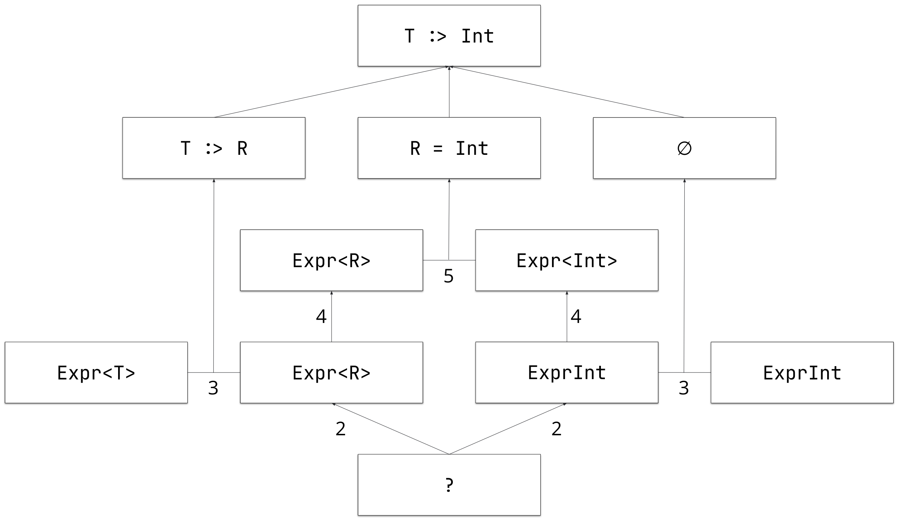
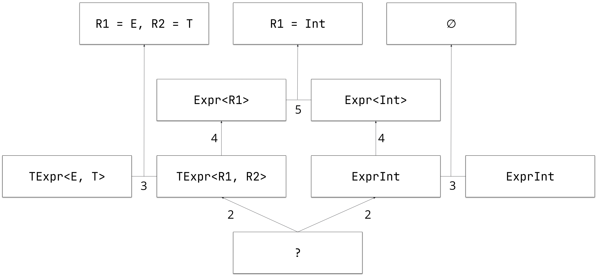
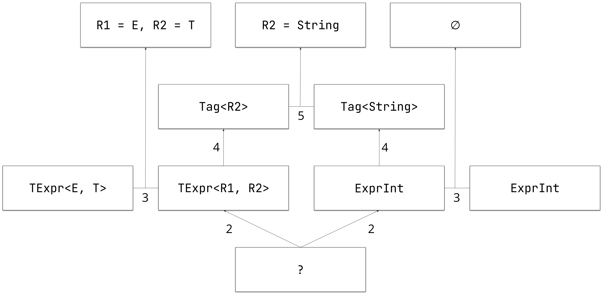

# Subtyping reconstruction aka GADT-style inference

## Introduction

### (Generalized) algebraic data types 

Kotlin currently allows one to declare algebraic data types, or *ADT*, via sealed classes/interfaces and data classes.
ADTs allows one to form a type by "algebraically" combining other types, where the sum type is represented as a sealed class/interface, and the product type is represented as a data class.
The beauty comes when ADTs are also equipped with pattern matching (`when` expressions) on their structure and types.

In functional programming (for example, with languages like Scala, OCaml, Haskell) there is a more powerful concept of generalized algebraic data types, or *GADT* (aka guarded recursive datatypes).
It is a generalization of parametric ADTs which permits value constructors to return specific, rather than parametric, type-instantiations of their own datatype.

The simplest example of the difference between ADT and GADT is the following.

```Kotlin
sealed class AdtBox<T>(val v: T)
class BarkingBox<T>(v: T, val friendliness: Int) : AdtBox<T>(v)
class PostBox<T>(v: T, val stamps: List<Stamp>) : AdtBox<T>(v)

sealed class GadtBox<T>(val v: T)
class IntBox(i: Int) : GadtBox<Int>(i)
class AggregateBox<T>(s: List<T>) : GadtBox<List<T>>(s)
```

`AdtBox` inheritors add new fields and change behavior, but they keep type parameter `T` *unchanged* and *unconstrained*.
On the contrary, `GadtBox` inheritors introduce new constraints on `T`, making it *specific* for a *specific inheritor*, which makes `GadtBox` a GADT and not just an ADT.

GADTs enable the storage of additional type information (type constraints or invariants) in ADTs, along with the ability of using this information when doing pattern matching.

One of the classic well-known GADT use-cases is ensuring type safety when defining DSLs.
For example, in Scala an arithmetic expression can be made type-safe by construction, e.g. it is impossible to construct an expression that uses binary operator on non-numerical values and tuples.

```Scala 
enum Expr[A]:
  case LitInt(i: Int) extends Expr[Int]
  case Add(e1: Expr[Int], e2: Expr[Int]) extends Expr[Int]
  case Tuple[X, Y](x: Expr[X], y: Expr[Y]) extends Expr[(X, Y)]
```

In the example, constructor `LitInt` ensures that the data being created is an `Expr[Int]`, not just some generalized `Expt[T]`, while binary addition constructor `Add` checks that its sub-expressions are numbers, i.e., are of type `Expr[Int]`.
Thus, in this case our *data type invariants* are: any integer literal is actually an integer, and any binary addition has integer sub-expressions.
This information is stored in the type itself, meaning there is no way to construct an ill-formed expression (for example, a binary addition of two tuples).

As ADTs come with pattern matching, generalized ADTs come with generalized pattern matching which uses the type information stored in GADTs to guarantee code type safety.
In other words, as GADTs represent *types correct by construction at compile-time*, generalized pattern matching *guarantees absence of type errors during run-time*.

Continuing on the previous example, the following function that evaluates arithmetic expressions is well-typed.

```Scala
def eval[T](e: Expr[T]): T = e match
  case LitInt(i) => i // GADT constraint `T =:= Int` allows the branch
                      // to return an `Int` and not a generic `T`
  case Add(e1, e2) => eval(e1) + eval(e2)
                      // GADT constraint allows to infer that `eval(Expr[Int])`
                      // returns an `Int` and not a generic `T`,
                      // which allows to use binary addition
  case Tuple(x, y) => (eval(x), eval(y))
                      // GADT constraint `T =:= Tuple` allows the branch
                      // to return a tuple and not a generic `T`
```

That is, we locally use the information stored in GADTs in specific branches of pattern matching, ensuring the branch is well-typed with respect to this information, and correctly "forget" the information outside of these branches.
Without the ability to do generalized pattern matching, GADTs lose most of their safety and expressive power.

As follows from these points, GADTs are most useful in applications where compile- and run-time type safety is especially important, for example, complex DSLs, strongly-typed evaluators, generic data structure pretty-printing, traversals and queries, or database access.

#### Real-world GADT-like examples in Kotlin

Several real-world examples of GADT-like use-cases could be found in Kotlin compiler:

1. [GitHub link](https://github.com/JetBrains/kotlin/blob/242c1cf5f0814fbe9df02b4b85a63298b30b4b67/core/reflection.jvm/src/kotlin/reflect/jvm/internal/calls/ValueClassAwareCaller.kt#L45)
2. [GitHub link](https://github.com/JetBrains/kotlin/blob/242c1cf5f0814fbe9df02b4b85a63298b30b4b67/compiler/resolution/src/org/jetbrains/kotlin/resolve/calls/KotlinCallResolver.kt#L165)
3. [GitHub link](https://github.com/JetBrains/kotlin/blob/242c1cf5f0814fbe9df02b4b85a63298b30b4b67/compiler/fir/providers/src/org/jetbrains/kotlin/fir/types/TypeUtils.kt#L211-L214)
4. [GitHub link](https://github.com/JetBrains/kotlin/blob/242c1cf5f0814fbe9df02b4b85a63298b30b4b67/jps/jps-plugin/src/org/jetbrains/kotlin/jps/model/ProjectSettings.kt#L72-L75)

Let's review the first example in more detail.

```Kotlin
    // interface Caller<out M>
    // class BoundStatic(...): Caller<ReflectMethod>
    // class BoundStaticMultiFieldValueClass(...): Caller<ReflectMethod>

    private val caller: Caller<M> = if (oldCaller is CallerImpl.Method.BoundStatic) {
        //                              From this ^ check we know that Caller<M> & BoundStatic
        //                              and could infer that M :> ReflectMethod
        val receiverType = (descriptor.extensionReceiverParameter ?: descriptor.dispatchReceiverParameter)?.type
        if (receiverType != null && receiverType.needsMfvcFlattening()) {
            val unboxMethods = getMfvcUnboxMethods(receiverType.asSimpleType())!!
            val boundReceiverComponents = unboxMethods.map { it.invoke(oldCaller.boundReceiver) }.toTypedArray()
            @Suppress("UNCHECKED_CAST")
            CallerImpl.Method.BoundStaticMultiFieldValueClass(oldCaller.member, boundReceiverComponents) as Caller<M>
            // This cast ^ is always safe,
            // because M :> ReflectMethod => Caller<M> :> Caller<ReflectMethod> :> BoundStaticMultiFieldValueClass
        } else {
            oldCaller
        }
    } else {
        oldCaller
    }
```

> For more advanced examples, see [More advanced GADT-like use-cases](#more-advanced-gadt-like-use-cases) section in Addendum.

### GADTs in Kotlin

Unfortunately, Kotlin allows one to define a GADT, but it has *no support for generalized pattern matching*.
This means that Kotlin users either have to avoid using GADTs (i.e., it's as if Kotlin does not support GADTs) or preserve and validate the data type invariants *by hand* (i.e., the users have to write boilerplate code with the possibility of making an error).

For example, if we translate the Scala example from above to Kotlin, it does not type check, because the Kotlin type checker is not able to infer that `e.i` is of type `Int`, even though in principle all necessary type information is there.

```Kotlin
sealed class Expr<out T>
class ExprIntLit(val i: Int) : Expr<Int>()

fun <T> eval(e: Expr<T>): T = when (e) {
    is ExprIntLit -> e.i // Type mismatch. Required: T, Found: Int
}
```

This KEEP proposes how the current Kotlin type system can be modified in order to cover this problem in the language design by adding support for generalized pattern matching.

Besides improvements to the GADT user experience, adding the support for generalized pattern matching also improves smart casts behaviour and allows one to get rid of a number of unsafe casts in the code even without the use of GADTs.

## From generalized pattern matching to subtyping reconstruction

As we have established, GADTs are associated with generalized pattern matching: when we match a value of GADT on one of its variants, we can infer precise type arguments for this value based on the type arguments in the matched GADT variant.
It is how the GADTs already work in many functional languages, but for object-oriented languages with inheritance-based subtyping it is not as easy and actually it is not enough to support only generalized pattern matching.

> The details of why it is so could be found in [the GADT formalization for C#](https://www.microsoft.com/en-us/research/wp-content/uploads/2016/02/gadtoop.pdf) and Scala 3 implementation.
> Additionally, you could see the [Bounds inference algorithm](#bounds-inference-algorithm) section of this KEEP.

In general you have access to additional type information when there is a value in the program that has two related types.
For functional languages, this happens, for example, with GADT and one of its specific variant type in pattern matching; for object-oriented languages, this can happen for two arbitrary types, when one is inherited from (is a subtype of) another.

This means for Kotlin we would need to have something more general than generalized pattern matching, something which allows to use the subtyping information anywhere.
We will call this *"subtyping reconstruction"*, as its core idea is to reconstruct additional subtyping information for related types.

Kotlin has a flow-sensitive type system, in order to support smart casts, i.e. it collects information about possible types of values in a flow-sensitive way, meaning it can track that a value has two possible types and it can know if these types are related.
Since this information is not limited to `when`-expressions, it allows us to have general subtyping reconstruction which is not limited to pattern matching only.

For example, the four examples below are actually well-formed as in all these cases we know that `e` is of both `ExprIntLit` and `Expr<T>` types, which means that `T =:= Int`.

```Kotlin
sealed class Expr<out T>
data class ExprIntLit(val i: Int) : Expr<Int>()

fun <T> evalWhen(e: Expr<T>): T = when (e) {
    is ExprIntLit -> e.i
}

fun <T> evalIs(e: Expr<T>): T {
    if (e is ExprIntLit) {
        return e.i
    }
    TODO()
}

fun <T> evalNotIs(e: Expr<T>): T {
    if (e !is ExprIntLit) {
        TODO()
    }
    return e.i
}

fun <T> evalEquality(e1: Expr<T>, e2: ExprIntLit): T {
    if (e1 === e2) {
        return e1.i
    }
    TODO()
}
```

The current type system implementation collects such statements (smart casts) only for separate variables, which makes these examples ill-typed.
Let us explain how we can extend the Kotlin type system to support subtyping reconstruction.

## Subtyping reconstruction

### Bounds inference algorithm

The subtyping reconstruction is based on bounds inference algorithm.
The purpose of this algorithm is to infer bounds for type arguments based on the extended subtype information available from Kotlin flow-sensitive type system.

As an input, the algorithm accepts a set of types `T1 & T2 & ...` for a specific value which this value definitely has at a specific program point.
As an output, it infers additional bounds for type arguments used in types `T1 & T2 & ...`.
The algorithm consists of two parts, generation of subtyping and equality constraints, and their resolution.

### Generation of constraints

The pseudocode for the constraint generation is shown below.

```Kotlin
fun generateConstraintsFor(supertypes: List<Type>) {
  val assumptions = List<Assumption>()
  val projections = supertypes.map {
    createRealTypeProjection(it.classifier)
  }
  supertypes.zip(projections).forEach {
    supertype, projection ->
      assumptions.add(projection <: supertype)
  }
  projections.cartesianProduct().forEach { proj1, proj2 ->
    val lowestCommonClassifiers: List<Classifier> = lcc(
      proj1.classifier, proj2.classifier)
    lowestCommonClassifiers.forEach { classifier ->
      val upcastedProj1 = upcast(proj1, classifier)
      val upcastedProj2 = upcast(proj2, classifier)
      assumptions.add(upcastedProj1 =:= upcastedProj2)
  }
}
```

The algorithm is based on two fundamental observations.
The first one is the existence of any object's real type that was assigned to the object during its creation.
The second is that this real type is a subtype of the inferred or ascribed type in the scope (type of the argument, type of the local variable, etc.) and the checked type (type of the classifier on the right side of the \kinline{is} or \kinline{as} expression, etc.).

> The second observation can sometimes be violated by the use of unsafe / unchecked casts.
> We do not consider such scenarios, leaving them, as usual, the responsibility of the user.

The input for the algorithm is a list of known supertypes for some value, which come from the compile-time information in the code (type declarations, type checks, etc.).

Stage 1: If these supertypes contain intersection types, we consider each of the intersection type components as a separate supertype.

Stage 2: Next, in line 3, we create so called "type projections" of the real type on the classifiers of these supertypes.
A type projection of a real type is also a real type, which is this supertype's classifier type parameterized with fresh type arguments (if any).
It can be viewed as a placeholder for the actual run-time type of the value.

Stage 3: Then, in line 6, we record the constraint that these type projections are subtypes of their corresponding supertypes, as the actual run-time type of the value will be a subtype of its compile-time checked supertype.

Stage 4: After that, in line 10, we iterate over all lowest common classifiers (line 14) for each possible pair of the type projections.
The lowest common classifiers are determined with respect to the inheritance relation.
Then, in line 14, we upcast both projections on all of those classifiers. 
Upcasting is the process of "lifting" the subtype to its supertype along the inheritance hierarchy together with the substitution of the type parameters.

Stage 5: Finally, we generate strict equalities between these upcasted projections, as they represent supertypes of the same type (real type of the analyzed value) w.r.t. the same classifier.
This is justified by the following paragraph of the Kotlin specification.

> The transitive closure S∗(T) of the set of type supertypes S(T : \(S_1\), . . . , \(S_m\)) = {\(S_1\), . . . , \(S_m\)} ∪ S(\(S_1\)) ∪ . . . ∪ S(\(S_m\))
> is consistent, i.e., does not contain two parameterized types with different type arguments.

#### Examples of constraint generation

##### Simple example

Let's review the algorithm on the following example.

```Kotlin
interface Expr<T>
interface ExprInt(var v: Int) : Expr<Int>

fun <T> eval(e: Expr<T>): T =
  when (e) {
    is ExprInt -> e.v
  }
```

As an input for the algorithm, we have two supertypes of the value `e`: `ExprInt` and `Expr<T>`.

The flow of the algorithm is shown in the following diagram.



The upper part of the diagram shows the final generated constraints.
Let's follow the algorithm step by step.

* Stage 1. Not applicable.
* Stage 2. Do type projection on `Expr<T>` to get `Expr<R>` (where `R` is a fresh type variable) and on `ExprInt` to get `ExprInt`.
* Stage 3. Record the constraints $Expr\langle T\rangle :> Expr\langle R\rangle$ and $ExprInt :> ExprInt$.
* Stage 4. For the lowest common classifier `Expr`, upcast the corresponding projections and get types $Expr\langle R\rangle$ and $Expr\langle Int\rangle$.
* Stage 5. Record the constraint $Expr\langle R\rangle =:= Expr\langle Int\rangle$.

##### Example with several lowest common classifiers

Let's review the algorithm on the following, more complicated example.

```Kotlin
interface Expr<T>
interface Tag<T>
interface TExpr<E, T> : Expr<E>, Tag<T>
interface ExprInt : Expr<Int>, Tag<String>

fun <E, T> eval(e: TExpr<E, T>): E = when (e) {
  is ExprInt -> e.value
}
```

As an input of the algorithm, we have two supertypes of the value `e`: `ExprInt` and `TExpr<E, T>`.

The flow of the algorithm is shown in the following diagrams:





Let's follow the algorithm step by step.

* Stage 1. Not applicable.
* Stage 2. Do type projection on `TExpr<E, T>` to get `TExpr<R1, R2>` (where `R1` and `R2` are fresh type variables) and `ExprInt` to get `ExprInt`.
* Stage 3. Record the constraints $TExpr\langle E, T\rangle :> TExpr\langle R1, R2\rangle$ and $ExprInt :> ExprInt$.
* Stage 4.
    * For the lowest common classifier `Expr`, upcast the corresponding projections and get types $Expr\langle R1\rangle$ and $Expr\langle Int\rangle$.
    * For the lowest common classifier `Tag`, upcast the corresponding projections and get types $Tag\langle R2\rangle$ and $Tag\langle String\rangle$.
* Stage 5.
    * Record the constraint $Expr\langle R1\rangle =:= Expr\langle Int\rangle$.
    * Record the constraint $Tag\langle R2\rangle =:= Tag\langle String\rangle$.

#### Special cases

* Flexible types. For flexible types, we have to run the algorithm on their upper bound, as it is the type that is guaranteed to be a supertype of the real type.

  Let's review the example with flexible types:
  
  * Java: 
    ```java
    class SerializableList implements List<Serializable> { ... }
    
    static <T> List<T> foo(T v) {
        if (v instanceof Serializable) {
             return SerializableList.of(v);
        } else {
             return SerializableList.empty();
        }
    }
    ```
  * Kotlin:
    ```Kotlin
    fun <T> bar(v: T): T { 
        val l = foo(v)
        // l : MutableList<T!>..List<T?>?
        if (l is SerializableList) {
            // Type intersection statement for lower bound: [{MutableList<T!> & SerializableList}]
            // Subtyping reconstruction results for lower bound: [T! =:= Serializable]
            // But this is unsound, f.e. see `baz`
    
            // Type intersection statement for upper bound: [{List<T?>? & SerializableList}]
            // Subtyping reconstruction results for upper bound: [T :> Serializable]
            // This result is always sound
    
            l.add(v)
    
            // After we have used the value as MutableList,
            //   we may state that l : MutableList<T!>
            // And then we could infer [T! =:= Serializable]
            // If it is unsound because of unsound `foo` implementation,
            //   we are not able to guarantee soundness,
            //   just as we cannot do that now.
            // If it is unsound because the result of `foo` is immutable,
            //   the unsoundness comes from the flexible types.
            // Therefore, either we soundly infer the correct bound or
            //   the code is unsound, but the reason for unsoundness
            //   is not the use of subtyping reconstruction.
        }
        ...
    }
    
    fun baz() {
        bar(object : Any() {})
    }
    ```

#### How this compares to the Scala GADT algorithm?

The algorithm is quite different from the Scala GADT algorithm and may infer bounds in more cases.
The main difference arises from the mentioned paragraph of the Kotlin specification, aka supertype set consistency, which allows to simplify and enhance the algorithm.

For instance, the following code:

```Scala
trait Func[-A, +B]
trait Identity[X] extends Func[X, X]
trait FalseIdentity extends Identity[Int], Func[Any, Int]
```

is valid in Scala, while the same code in Kotlin:

```Kotlin
interface Func<in A, out B>
interface Identity<X> : Func<X, X>
interface FalseIdentity : Identity<Int>, Func<Any, Int>
```

fails to compile with error: `Type parameter B of 'Func' has inconsistent values: Int, Any`.

As a result, for the code like this:

```Kotlin
fun <A, B> foo(func: Func<A, B>) = when (func) {
    is Identity<*> -> {
        val b: B = mk() as A
    }
    else -> TODO()
}
```

we are able to infer relation $A <: B$ in Kotlin.

However, this is not a case for Scala, as there we may have a value of `FalseIdentity` type, for which $A$ would be `Any` and $B$ would be `Int`, and these do not satisfy $A <: B$.

### Constraint resolution

The second part of the subtyping reconstruction, constraint resolution, is very similar to the resolution of the type constraint system during regular type inference.
Roughly speaking, this resolution works this way: reduce (simplify) input constraints until all of them are simple enough, i.e., transform a set of input constraints into a set of output (reduced) constraints.

```Kotlin
fun resolveConstraints(constraints: Set<Constraint>): Set<Constraint>
```

Let's denote the reduced set of constraints as $R$ and the input set of constraints as $C$.

The ideal behavior of the reduce function is: $R <==> C$, meaning that the input and reduced set of constraints are exactly equivalent.
Consequently, if there is a solution for the original set of constraints, then there is a solution for the reduced set of constraints and vice versa.

Usually it is impossible to always express the original constraints using simpler ones due to the constraint handling limitations (undecidability, approximations, etc.).
In these cases, the behavior of the reduce function is: $R ==> C$, meaning that the reduced set of constraints is stricter than the original one.
Consequently, if there is a solution for the reduced set of constraints, then there is a solution for the original set of constraints, but not vice versa.

> Such behavior means that, if some code is type-safe for reduced set of constraints, it is also type-safe for original set of constraints.
> Because of this, we will reject some type-safe code as unsafe, but we will never accept type-unsafe code as safe.

For subtyping reconstruction, which provides additional information, we should relax the behavior in the other direction and allow the reduced set of constraints to be weaker, meaning the behavior of the reduce function can be: $R <== C$.
Consequently, if there is a solution for the original set of constraints, then there is a solution for the reduced set of constraints, but not vice versa.

> Such behavior means that subtyping reconstruction could add less information than available in the original set of constraints, but it can never add information which was not there.
> This preserves the type safety property: for a given set of inference constraints `T`, which we want to enhance with subtyping reconstruction information, if $C ==> R$, we have $T\ \\&\ R ==> T\ \\&\ C$.

To implement this, we have to adapt the existing resolution algorithm to this new relaxed strategy.
We did not do a complete adaptation in the developed prototype, but we believe it is definitely feasible to do so, given enough time.

#### Examples of constraint resolution

##### Resolution of type variable constraint

For example, say we are trying to reduce the constraint $S <: T$, where `T` is a type variable.

For the regular inference, the result of the reduction algorithm may be $S <: LB(T)$, where $LB(T)$ is the lower bound of `T`.
This constraint guarantees that the original constraint is always satisfied.

For the subtyping reconstruction inference, the result of the reduction algorithm may be $S <: UB(T)$, where $UB(T)$ is the upper bound of `T`.
This constraint is guaranteed to be satisfied by the original constraint.

##### Resolution with intersection types

If we would like to satisfy a constraint `A :> B & C`, this results in a disjoint constraints `A :> B | A :> C` which is (exponentially) hard to solve.
As stated [here](https://youtu.be/VV9lPg3fNl8?t=1391), if Scala GADT algorithm encounters such situation, these disjoint constraints are skipped. 
In case if all-except-one of the disjoint constraints are immediately unsatisfied, then such a constraint could be processed.

In the current algorithm we propose to adopt the Scala approach and ignore such constraints.
However, it is possible to consider implementing some kind of heuristics to handle these constraints.

##### Resolution with flexible types

For flexible types, we have to follow [their subtyping rules](https://github.com/JetBrains/kotlin/blob/master/spec-docs/flexible-java-types.md) when doing constraint reduction.
More precisely:

* $A :> B..C => A :> C$
* $B..C :> A => B :> A$
* $A = B..C => B :> A, A :> C$

##### Resolution with nullable types

As we discussed earlier, subtyping reconstruction is based on the assumption that the intersection type is inhabited by a run-time value of some real type.
For nullable types, however, this assumption is trivially satisfiable, as `null` is always a valid value for any nullable type.
The same holds for an intersection type when all its components are nullable.

This means that, for such trivially satisfiable cases, we cannot perform any subtype reconstruction.

An example of such a case and why it would be unsound to do subtyping reconstruction for nullable types, is as follows:

```Kotlin
fun <T> foo(b: Box<T>?, t: T): T {
    if (b is BoxInt?) {
        // [{Box<T>? & BoxInt?}] => T =:= Int
        return 1
    }
    ...
}

println(foo(null, "str")) // ClassCastException as we are trying to cast Int to String
```

It is important to note that we should still track such nullable (intersection)types, as once we encounter a not-null check, the type would become non-nullable, and we would be able to do subtyping reconstruction.

#### Special cases

##### Type projections

Projections are handled by the resolution algorithm via capturing.
As a result of this, we will have some constraints which may contain captured types.

The problem here is that currently Kotlin approximates captured types to regular types immediately after the type system solution, and programmers do not interact with captured types directly, which is good for regular type inference.

For subtyping reconstruction, however, we cannot approximate captured types after the resolution of constraints, as it may lead to unsound results.
Let's review some examples of this using the following definitions.

```Kotlin
class Inv<T>
class Out<out T>
class In<in T>
```

1. If the algorithm produces constraint $T :> Out\langle Captured(\*)\rangle$, then this only provides us information that `T` is not nullable and $Out\langle T> :> Out\langle Out\langle Any?\rangle\rangle$.
   If we approximated it, we would get $T :> Out\langle \*\rangle$, which leads to $T :> Out\langle \*\rangle :> Out\langle Int\rangle$, and this is unsound with respect to the original constraint.
   The reason for unsoundness is that after the approximation we do not get a relaxed type, we get a strengthened type.
   We have a relation $Out\langle \*\rangle :> Out\langle Captured(\*)\rangle$ between approximated and original type.
   And we cannot infer $T :> Out\langle \*\rangle$ from $T :> Out\langle Captured(\*)\rangle$ and $Out\langle \*\rangle :> Out\langle Captured(\*)\rangle$.

2. On the contrary, for $Out\langle In\langle Captured(\*)\rangle\rangle$ 
   we are able to approximate the constraint $T :> Out\langle In\langle Captured(\*)\rangle\rangle$ to $T :> Out\langle In\langle \*\rangle\rangle$.
   This is because $Out\langle In\langle Captured(\*)\rangle\rangle :> Out\langle In\langle \*\rangle\rangle$, i.e. for this constraint approximation properly relaxes the approximated type.
   And we can infer $T :> Out\langle In\langle \*\rangle\rangle$ from $T :> Out\langle In\langle Captured(\*)\rangle\rangle$, $Out\langle In\langle Captured(\*)\rangle\rangle :> Out\langle In\langle \*\rangle\rangle$ and transitivity rule. 

The core principle is that by approximating a type with captured types during subtyping reconstruction, we should be relaxing the approximated type constraints.

In addition, we are losing some type information with this relaxation, specifically we lose the equalities between the captured types (and their corresponding existential variables).
For example, if we have a constraints $V = Inv\langle Captured(\*)\rangle$ and $U = Inv\langle Captured(\*)\rangle$, where the captured types are equal, we should be able to call a function `fun <T> foo(i1: Inv<T>, i2: Inv<T>)` with the values of types `V` and `U`.
But after approximation this information will be lost.

> Such code with captured type equalities happens when you are working with data structures that are controlling some invariants on the type level, for example, AVL tree with type-level control of the balance factor.

The possible solutions to this problem are:

1. Erase all bounds containing captured types that could not be soundly approximated.
   The type system will be sound in this case.
   But, this option will limit the applicability of the subtyping reconstruction. 
   For example, the last example above will not work, meaning `foo(V, U)` will be ill-typed.

2. Preserve the captured types in the constraints.
   This option will complicate the compiler diagnostics as currently captured types are not really supposed to be printed.
   On the other hand, this option will increase the applicability of the subtyping reconstruction and allow to improve the handling of captured types in other parts of the type system as well, making them closer in expressiveness to existential types (which they actually are).
  However, this would require some additional work around how captured types are handled in the type system implementation.

## Adding subtyping reconstruction to Kotlin flow-sensitive type system

Now that we have an algorithm which allows us to infer additional information about types, we need to integrate this algorithm to our flow-sensitive type system.
Here we explain the steps needed to achieve that.

### New types of control-flow graph statements

We introduce a new type of statements handled by the data-flow analysis, called *type intersection*.
Type intersection statement for value `v` with types `T1 & T2 & ...`says that, in a specific node of a control-flow graph, value `v` definitely has a set of types `T1 & T2 & ...`, and these types should be used for subtyping reconstruction. 

After type intersection statements are handled by the subtyping reconstruction, we get additional type constraints, which are also stored and used by the data-flow analysis as *subtyping reconstruction result* statements.

For example, let us consider the following code.

```Kotlin
open class Box<T>
class BoxString : Box<String>()

interface ListString : List<String>

fun <T> foo(box: Box<T>, list: List<T>): T {
    if (...) {
        box as BoxString
        // Type intersection statement: [{Box<T> & BoxString}]
        // Subtyping reconstruction results: [T =:= String]
    } else {
        list as ListString
        // Type intersection statement: [{List<T> & ListString}]
        // Subtyping reconstruction results: [T :> String]
    }
    // Merged subtyping reconstruction results: [T :> String]
}
```

We are able to infer that `T :> String` at the end of the function, because we can merge different subtyping reconstruction results from different control-flow graph branches.
In other words, type intersection statements *locally* add information used by the subtyping reconstruction algorithm, which creates subtyping reconstruction results used *globally* in a flow-sensitive way.

### Flow-sensitive type checker state

Compared to regular smart casts, which are simply refining variable types, subtyping reconstruction adds arbitrary new type constraints.
To use them, we have to incorporate them into the type system when needed.
As in different control-flow graph nodes these constraints might be different, it means the type checker state becomes "flow-sensitive", i.e., it additionally depends on the data-flow analysis state.

### Examples

An example that utilizes flow-sensitivity was already shown in [Real-world GADT-like examples in Kotlin](#real-world-gadt-like-examples-in-kotlin) section.
There we used data flow to propagate $M :> ReflectMethod$ in the body of the `if` expression.

Let's review the second example from the Kotlin compiler from this section as it demonstrates the power of flow-sensitive subtyping reconstruction better.

```Kotlin
interface CandidateFactory<out C>
class CallableReferencesCandidateFactory(...) : CandidateFactory<CallableReferenceResolutionCandidate>

interface ScopeTowerProcessor<out C>

fun createCallableReferenceProcessor(CallableReferencesCandidateFactory): ScopeTowerProcessor<CallableReferenceResolutionCandidate>

fun <C : ResolutionCandidate> resolveCall(
        // ...
        kotlinCall: KotlinCall,
        candidateFactory: CandidateFactory<C>,
    ): Collection<C> {
        @Suppress("UNCHECKED_CAST")
        val processor = when (kotlinCall.callKind) {
            KotlinCallKind.CALLABLE_REFERENCE -> {
                createCallableReferenceProcessor(candidateFactory as CallableReferencesCandidateFactory) as ScopeTowerProcessor<C>
            }
            // ...
        }
        // ...
    }
```

In this example we are able to eliminate unsafe cast `as ScopeTowerProcessor<C>` using subtyping reconstruction.

It might look like we are getting the subtyping information from a `when` expression, however, `KotlinCall` is just an enum class without type parameters.
Thus, it does not provide any subtyping information.

The actual origin of the information is the cast of `candidateFactory` to `CallableReferencesCandidateFactory`.
From `[{CandidateFactory<C> & CallableReferencesCandidateFactory}]` we are able to infer `C :> CallableReferenceResolutionCandidate`.
This information is propagated through the data flow to the next cast, `as ScopeTowerProcessor<C>`, where it is used to check that `ScopeTowerProcessor<C> :> ScopeTowerProcessor<CallableReferenceResolutionCandidate>`.

## When subtyping reconstruction is not enough

### When there is no expected type

Typechecking expressions, when there is an expected type dependent on subtyping reconstruction results, is not a problem, as the following example demonstrates.

```Kotlin
fun <T> foo(v: Box<T>) {
    val t: T = when (v) {
        is BoxString -> "string" // [T =:= String]
        is BoxInt -> 1 // [T =:= Int]
    }
}
```

However, if there is no expected type, in many cases the subtyping reconstruction information alone will not be able to help us.

```Kotlin
fun <T> foo(v: Box<T>): T {
    val t = when (v) {
        is BoxString -> "string" // [T =:= String]
        is BoxInt -> 1 // [T =:= Int]
    }
    // Subtyping reconstruction results on T are empty
    //   merge([T =:= String], [T =:= Int]) = []

    // t is inferred to be of type Comparable<*>
    //   and we actually have no reason to try and infer it
    //   to T & Comparable<*>
    return t
}
```

> We have some ideas of how this problem might be solved, which we will present in an additional KEEP.

### When there is overload resolution

Overload resolution is another case when we do not have an expected type, which stops us from using the subtyping reconstruction results.

Let's consider the following example.

```kotlin
sealed interface Box<T>
class BoxInt : Box<Int>

fun foo(a: Any?) = println("Any?")
fun foo(s: String) = println("String")
fun foo(i: Int) = println("Int")

fun <T> bar(t: T, b: Box<T>) = foo(when (b) {
    is BoxInt -> t
})
```

Since the actual expected type for the argument of `foo` is unknown, the inferred type for the argument expression is `T` (similarly to the example above), and we resolve the call to `foo(a: Any?)`.

In case we do not have any overload resolution involved (aka if we remove the overloads with `Any?` and `String`), then `foo` will be successfully resolved to `foo(i: Int)`, if we perform subtyping reconstruction.
This happens because in case we only have one overload, we can use it to get the expected type, and with it we are able to infer `Int` for the argument.

### Can we fix these problems?

We do not have a good universal solution for these problems.

One of the possible solutions could be to preserve the constraint information in the inferred types.
For the `when` example, when propagating the type `Int`, knowing that we also have `T =:= Int`, we could transform the type into `T & Int`.
Together with `T & String`, we could then infer `T & Comparable<*>` for the whole `when` expression.

However, for more complex subtyping reconstruction results, this naive solution does not work.
For example, assume we have `T <: Box<T>`.
If we transform the type to `T & Box<T>`, we would not be able to type check against expected type `Box<out Box<T>>`.

Fundamentally, this means we may need to add ways to encode recursuve types (aka `µ` types) or some other ways to propagate such complex (e.g., recursive) constraints in the type system.

We leave the solutions to these problems for possible future work.

## Feature interaction

Subtyping reconstruction potentially interacts with multiple other Kotlin features.
Here we describe these interactions and how they improve Kotlin.

> Note: all these interactions and improvements are *optional*, meaning they could be added, but it is not mandatory for the subtyping reconstruction to work.

### Bare types

Subtyping reconstruction has an interesting interaction with inference of bare types.
Bare type interence happens for cases when there are generic types with omitted type parameters, for example, in the following code.

```Kotlin
fun <T> foo(l: Collection<T>) {
    when (l) {
        is List -> ... // l : List<T>
        is Set -> ... // l : Set<T>
    }
}
```

Now, type parameters of bare types are inferred from the type parameters of the is-checked value.
And this bare type inference is fundamentally a restricted and flawed version of the subtyping reconstruction algorithm.

The flaws come from the handling of projections, which are not approximated when needed.

```Kotlin
private fun <E> List<E>.addAnything(element: E) {
    if (this is MutableList) {
        // Bare type inference: MutableList<E>
        // Subtyping reconstruction: MutableList<out E>
        this.add(element)
    }
}
```

This means that adding subtyping reconstruction could also improve bare type inference.

### Builder inference

<!-- Unreviewed section -->

Builder inference is a feature allowing to infer a type of the lambda's parameters based on the code inside the lambda.
During the typing of lambda, type parameters are replaced with flexible type variables.
Constraints on them collected during type-checking and their value inferred on the lambda's exit.

This feature conflicts with subtyping reconstruction 
because later one requires the exact types in intersection during the type-checking, not at the lambda's exit.
For example, in the following code:

```Kotlin
interface Inv<T>
interface InvInt : Inv<Int>

fun <T> foo(v: Inv<T>, t: T) = buildList {
    add(v) // From this statement, we inferred that the type parameter of the lambda is Inv<T>
    if (this.first() is InvInt) { 
        // But at the moment of this check, we have TypeVariable(E) as a type of lhs expression
        // Consequently, we are not able to infer that T =:= Int inside the `if` branch
    }
}
```

While the same code without builder inference would work correctly.
This is not a significant issue as builder inference has other issues with the same origin, 
and all of them could be fixed by explicit type annotations for the lambda parameters.

### Smart casts

The other existing feature that is affected by subtyping reconstruction is smart casts.
We could add the information from the subtyping reconstruction, so that it is usable by the smart casts, for example:

```Kotlin
interface A<in T, in V>
interface A1<in V> : A<Int, V>
interface A2<in T> : A<T, Int>

fun f(v: A1<*>) {
    val v1 : A2<Int> = when (v) {
        is A2<*> -> v // Now: A1<*> & A2<*>
                      // With subtyping reconstruction: A1<Int> & A2<Int>
        else -> throw Exception()
    }
}
```

### Unreachable code detection

To detect more unreachable code, using the additional type constraints from the subtyping reconstruction, we can run the type inference algorithm and then check that all inferred constraints are satisfiable.

The constraints are satisfiable, if for each type parameter and variable, their types are inhabited, i.e., there exists at least one type satisfying all their constraints.
To check this, we can use the following algorithm.

1. Find all types that are the least common supertypes for all lower bounds.
2. Check that any of those types is a subtype of all upper bounds.

If there is no such type, then the constraints are unsatisfiable, meaning the code with these constraints is unreachable.

A simple, but incomplete approximation of this property is to check whether all of the lowerbounds are subtypes of all of the upperbounds.

### Exhaustiveness checking

One of the most common use-cases for unreachable code detection is exhaustiveness checks.
Additional information from type constraints could be used to improve them.
For example, this code is marked as non-exhaustive.

```Kotlin
interface A
interface B

sealed interface I<T>
class IA : I<A>
class IB : I<B>

fun <T : A> f(i: I<T>) {
    when (i) {
        is IA -> TODO()
        // IB is impossible,
        // as `T <: A & IB <: I<T>` is unsatisfiable
    }
}
```

And the following code is marked as correct in Kotlin 2.0.

```Kotlin
interface A
interface B

sealed interface I<T>
class IA : I<A>
class IB : I<B>

fun <T : A> f(i: I<T>) {
    when (i) {
        is IA -> TODO()
        is IB -> TODO()
        // IB is still impossible,
        // as `T <: A & IB <: I<T>` is still unsatisfiable
    }
}
```

At the moment, Kotlin does not consider satisfiability of all available type constraints in exhaustiveness checking.
But this feature is one of the important parts of the GADT generalized pattern matching.

To implement better exhaustiveness checking, we can reuse the same idea as for the detection of unreachable code.
In this case, we have to infer constraints for each unmatched classifier and remove classifiers that are impossible aka have unsatisfiable constraints.

## Possible breaking changes

### Overload resolution changes

As we will extend the type information, aka infer more precise types if subtyping reconstruction is available, it may affect the overload resolution results.
For example:

```Kotlin
interface A
interface B : A

interface Out<out T>
interface OutB : Out<B>

fun <T> f(b: B, out: Out<T>) {
    fun A.foo() = "A"
    fun T.foo() = "T"
    
    when (out) {
        is OutB -> {
            // we infer that T :> B
            
            b.foo()
            // before: resolved to A.foo()
            // now: resolved to A.foo() and T.foo(), ambiguity error
        }
        else -> TODO()
    }
}
```

While this is technically a problem, in general [we do not consider](https://kotlinlang.org/docs/kotlin-evolution.html#libraries) overload resolution changes caused by inference of more precise types as a breaking change.

## References

1. [Presentation of the Scala 3 implementation from the typelevel summit](https://www.youtube.com/watch?v=VV9lPg3fNl8)
2. [Description of the Scala 3 implementation](https://dl.acm.org/doi/pdf/10.1145/3563342) (Section 6.2)
3. [Formalization of GADTs for C#](https://www.microsoft.com/en-us/research/wp-content/uploads/2016/02/gadtoop.pdf) (Section 5.1)

## Addendum

### Prototype

[Prototype implementation](https://github.com/e2e4b6b7/kotlin/pull/2)

Prototype was written in the beginning of the KEEP design, and it does not support the full algorithm described in this document.

The current prototype limitations are:

* We save type intersection statements, and not subtyping reconstruction results in the DFA => we have non-optimal data-flow union.
* We use different algorithm of constraint generation => it is more complex and covers fewer possible cases.
* We use ad-hoc handwritten constraint resolution algorithm => it works only in the most simple cases.
* Improper handling of captured types => the subtyping reconstruction results are unsound in some cases.

### More advanced GADT-like use-cases

[Sources and more examples](https://chrilves.github.io/posts/gadts_by_use_cases/)

#### Run-time subtyping evidence

One simple, but useful in some domains (e.g., type-safe DSLs for data queries), benefit of GADTs is the ability to express, store and use type relations such as $A <: B$ or $A =:= B$ in your code.

```Kotlin
sealed interface EqT<A, B>{
  class Evidence<X> : EqT<X, X>
}

sealed interface SubT<A, B>{
  class Evidence<A, B : A> : SubT<A, B>
}
```

It may be used like this:

```Kotlin
class Data<S, D> {
  val value: D = ...
  // ...
  fun coerceJsonToString(ev: EqT<D, JsonNode>): Data<S, String> =
    when (ev) {
      is EqT.Evidence<*> -> Data(this.value.convertJsonNodeToString())
      // Inferred: D =:= JsonNode
      //   e.g. it is type-safe to do this.value.convertJsonNodeToString()
    }
  // ...
}
```

Without the subtyping reconstruction, you could have the following solutions to this problem.

* Write or generate separate implementations for each possible combination of types.
  This will require much additional code with significant code duplication.
* Pass the type relation properties as other values (e.g., as a boolean, enum value or a string).
  In this case, we have to explicitly write error-prone casts in every place where we rely on the type relations.

All these solutions are less type-safe and more prone to human errors.

#### Type-safe extensions

Let's say we have a library for chart drawing.

```Kotlin
sealed interface Chart<A> {
    fun draw(chartData: A)
}
class PieChart : Chart<PieData>
class XYChart : Chart<XYData>
```

If we would like to write an extension which draws pie charts differently, it may look like this:

```Kotlin
fun <A> Chart<A>.customDraw(chartData: A): Unit =
  when (this) {
    is PieChart -> {
      val pieData = chartData as PieData
      ... // modify
      draw(pieData)
    }
    else -> draw(chartData)
  }
```

The programmer has to explicitly cast `chartData` to `PieData`, however this could be inferred by subtyping reconstruction. 
The resulting code becomes more type-safe and less verbose.

```Kotlin
fun <A> Chart<A>.customDraw(chartData: A): Unit =
  when (this) {
    is PieChart -> {
      // We know that `A =:= PieData` here
      //   aka we know that chartData is PieData
      ... // modify
      draw(chartData)
    }
    else -> draw(chartData)
  }
```

### Sources

> Here we have an assortment of papers about GADT use-cases / Scala libraries with GADT usages, which show the advantages and the feasibility of GADT-style inference.

* https://github.com/higherkindness/mu-scala
* https://github.com/AdrielC/free-arrow
* https://github.com/milessabin/shapeless
* https://github.com/owlbarn/owl
* http://www.cs.nott.ac.uk/~psznhn/Publications/icfp2005.pdf
* http://gallium.inria.fr/~fpottier/publis/fpottier-regis-gianas-typed-lr.pdf
* http://pauillac.inria.fr/~fpottier/slides/slides-popl04.pdf
* https://www.cs.tufts.edu/~nr/cs257/archive/tim-sheard/lang-of-future.pdf
* https://infoscience.epfl.ch/record/98468/files/MatchingObjectsWithPatterns-TR.pdf
